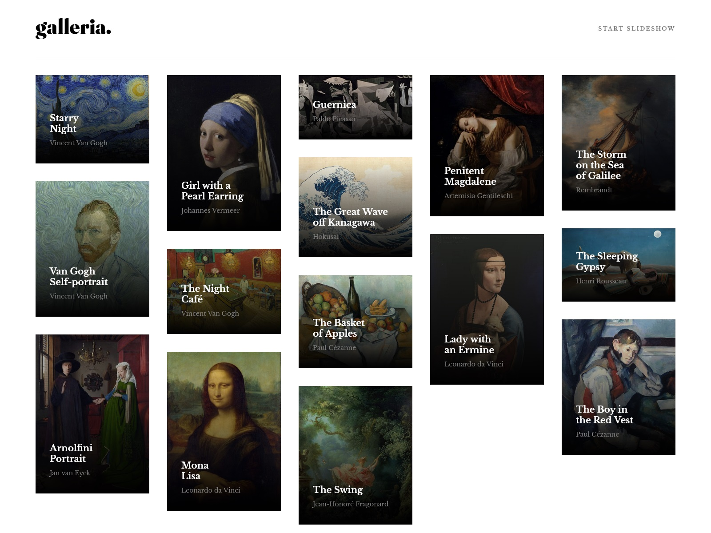

# Frontend Mentor - Galleria slideshow site

This is a solution to the [Galleria slideshow site on Frontend Mentor](https://www.frontendmentor.io/challenges/galleria-slideshow-site-tEA4pwsa6). Frontend Mentor challenges help you improve your coding skills by building realistic projects.

## Table of contents

- [Overview](#overview)
  - [The challenge](#the-challenge)
  - [Screenshot](#screenshot)
  - [Links](#links)
- [My process](#my-process)
  - [Built with](#built-with)
  - [What I learned](#what-i-learned)
- [Author](#author)

## Overview

### The challenge

Users should be able to:

- Go to specific image
- Start a slideshow

### Screenshot

### Links

- Solution URL: [Solution](https://www.frontendmentor.io/solutions/galleria-slideshow-site-2aoMUtdm37)
- Live Site URL: [Live](https://frontend-mentor-galleria-slideshow.vercel.app/)

## My process

### Built with

- Astro
- SCSS
- TransitionAPI
- Minimasonry (it doesn't work well with server side generated components)

### What I learned

I just wanted to check how to work with Transitions with Astro framework

### Author

- Frontend Mentor - [@Pawel-Gnat](https://www.frontendmentor.io/profile/Pawel-Gnat)
- Instagram - [@pawel.coder](https://www.instagram.com/pawel.coder/)
